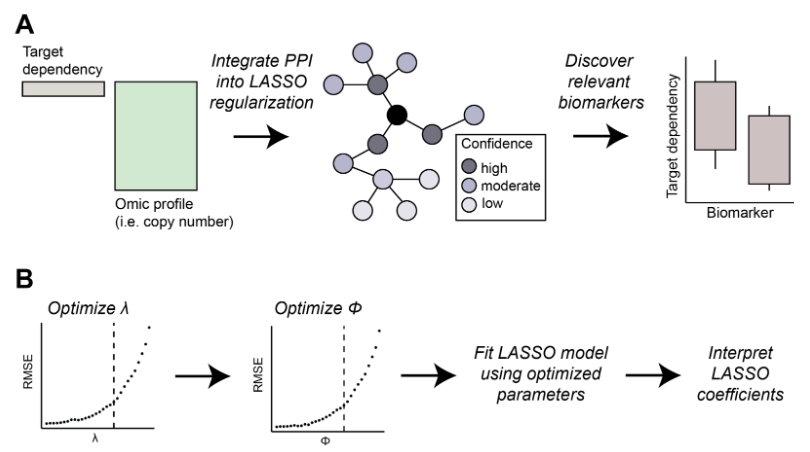

package_processingExample
================
2024-08-15

## Bio-primed machine learning to enhance discovery of relevant biomarkers

<p align="middle">
  
</p>

## *R library: BioPrimeLASSO*

## Introduction

Precision medicine relies on identifying reliable biomarkers for gene
dependencies to tailor individualized therapeutic strategies. The advent
of high-throughput technologies presents unprecedented opportunities to
explore molecular disease mechanisms but also challenges due to high
dimensionality and collinearity among features. Traditional statistical
methods often fall short in this context, necessitating novel
computational approaches that harness the full potential of big data in
bioinformatics. Here, we introduce a novel machine learning approach
extending the LASSO regression framework to incorporate biological
knowledge, such as protein-protein interaction (PPI) databases, into the
regularization process. This approach prioritizes variables that are
both statistically significant and biologically relevant. Applying our
method to multiple dependency datasets, we identified biomarkers which
traditional methods overlooked. Our biologically-informed LASSO method
effectively identifies relevant biomarkers from high-dimensional
collinear data, bridging the gap between statistical rigor and
biological insight. This method holds promise for advancing personalized
medicine by uncovering novel therapeutic targets and understanding the
complex interplay of genetic and molecular factors in disease.

## R Package walkthrough

1)  Load library

``` r
install.packages("devtools")
library("devtools")
install_github("dmhenke/BioPrimeLASSO")
library(BioPrimeLASSO)
library(curl)
if (!requireNamespace("BiocManager", quietly = TRUE))
    install.packages("BiocManager")
BiocManager::install("biomaRt")
```

2)  Load data (\< 2 Gb)

``` r
cnv <- read.csv(curl("https://drive.google.com/file/d/1dtKIOnx_lVn5glp67ItjPbiSdE10ZFFm/view?usp=drive_link"),sep = '\t',header=T)
ppi <- read.csv(curl("https://drive.google.com/file/d/1loo9kdMwAUYoJrBCwe3Dk1b9TDDyY72e/view?usp=drive_link"),sep = '\t',header=T)
demeter2 <- read.csv(curl("https://drive.google.com/file/d/1loo9kdMwAUYoJrBCwe3Dk1b9TDDyY72e/view?usp=drive_link"),sep = '\t',header=T)
```

2.1) Load supplemental information

``` r
## Load gene information ####
mart <- useDataset("hsapiens_gene_ensembl", useMart("ensembl"))
gene_info <- getBM(
  attributes = c("chromosome_name", "start_position", "hgnc_symbol"),
  filters = "hgnc_symbol",
  values = colnames(cnv),
  mart = mart)
## Refine data
chrs <- as.character(1:22)
gene_info <- gene_info[gene_info$chromosome_name %in% chrs, ]
uniq <- names(which(table(gene_info$hgnc_symbol) == 1))
gene_info <- gene_info[gene_info$hgnc_symbol %in% uniq, ]
gene_info$chromosome_name <- factor(
  gene_info$chromosome_name, levels = chrs)
```

3)  Identify gene of interest: EGFR

``` r
GoI <- "EGFR"
```

4)  Setup objects for analysis

``` r
# Dependency score resource: demeter2
y <- na.omit(demeter2[,GoI])

# Identify 'omic information to test against dependency score: cnv
X_omic <- na.omit(cnv)

## Refine population to overlapping cell lines
ok_cells <- intersect(names(y), rownames(X_omic))
X_omic_OK  <- X_omic[ok_cells, ]
y_ok <- y[ok_cells]

## Remove features without variance ####
# "CNV"
X_omic_OK <- X_omic_OK[, apply(X_omic_OK, 2, var) > 0]

### Generate scores
# Format: colnames(network) <- c("combined_score","gene1","gene2")
scores <- get_scores(gene=GoI, network=ppi)
```

5)  Run LASSO

``` r
results_omic <- biolasso(
  scale(X_omic_OK), y_ok, scores,
  n_folds = 10, phi_range = seq(0, 1, length = 30))
```

6)  Visualize results

``` r
# Add Pearson correlation: cor2score
results_omic$cor2score <- cor(
  X_omic_OK, y_ok,
  use = "pairwise.complete")[,1]

# Plot: Manhattan plot
## Correlation of Dependency score and CNV for each gene
## Overlay bio-primed LASSO & baseline LASSO hits
plot_manhattan(gene=GoI,resIn="../Outputs/EGFR_demeter2_CNV.RData",subplotChr=11,dependency=demeter2,dir_save="../Outputs/Graphics/")
```
