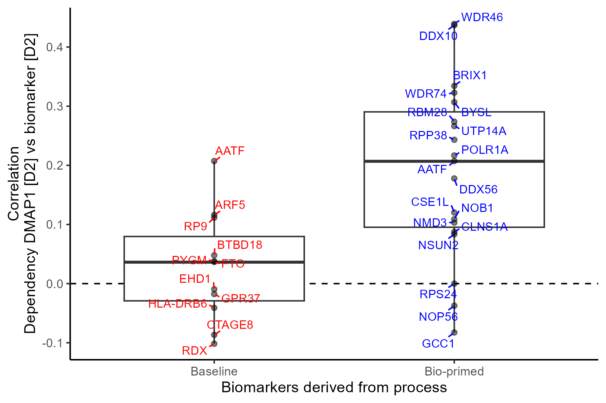
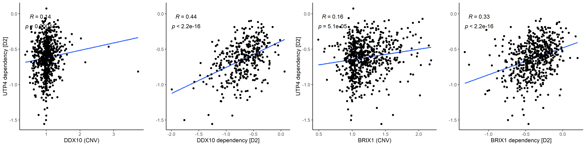

# Figure 4 walk-through

## Biologically informed biomarkers show stronger co-dependency

#### 1) Library loads

``` r
library("BioPrimeLASSO")
library("biomaRt")
library("ggplot2")
library("ggpubr")
library("ggrepel")
```

#### 2) Load toy data (total size \~1Gb)

In this example we will use BioPrimeLASSO to discover RNASeq biomarkers for *UTP4* dependency. BioPrimeLASSO also makes use of Protein-Protein interaction information from STRING DB. Please download the following three files (total size \~1.5Gb):

1.  Protein-protein interaction network ([ppi_w_symbols.tsv](https://drive.google.com/file/d/1-Flap0yM1Ba4d8ibVYs6ha82snsmAu-v/view?usp=drive_link))
2.  Copy number variation ([cnv.tsv](https://drive.google.com/file/d/1dtKIOnx_lVn5glp67ItjPbiSdE10ZFFm/view?usp=drive_link))
3.  Demeter2 dependency data ([demeter2.tsv](https://drive.google.com/file/d/1loo9kdMwAUYoJrBCwe3Dk1b9TDDyY72e/view?usp=drive_link))

``` r
cnv <- read.csv("./cnv.tsv",sep = '\t',header=T)
ppi <- read.csv("./ppi_w_symbols.tsv",sep = '\t',header=T)
demeter2 <- read.csv("./demeter2.tsv",sep = '\t',header=T)
```

#### 2.1) Load supplemental information

Next, we load some information for each gene including genomic location using the

``` r
mart <- useDataset("hsapiens_gene_ensembl", useMart("ensembl"))
gene_info <- getBM(
  attributes = c("chromosome_name", "start_position", "hgnc_symbol"),
  filters = "hgnc_symbol",
  values = colnames(cnv),
  mart = mart)

chrs <- as.character(1:22)
gene_info <- gene_info[gene_info$chromosome_name %in% chrs, ]
uniq <- names(which(table(gene_info$hgnc_symbol) == 1))
gene_info <- gene_info[gene_info$hgnc_symbol %in% uniq, ]
gene_info$chromosome_name <- factor(
  gene_info$chromosome_name, levels = chrs)
```

#### 3) Define gene of interest: *UTP4*

``` r
GoI <- "UTP4"
```

#### 4) Setup data objects for analysis

``` r
# Dependency score resource: Chronos
y <- demeter2[,GoI]
names(y) <- rownames(demeter2)
y <- na.omit(y)

# Identify 'omic information to test against dependency score: cnv
## Remove features without variance ####
X_omic <- cnv[,complete.cases(t(cnv))]
X_omic <- X_omic[, apply(X_omic, 2, var) > 0]

## Refine population to overlapping cell lines
ok_cells <- intersect(names(y), rownames(X_omic))
X_omic_OK  <- X_omic[ok_cells, ]
y_ok <- y[ok_cells]

### Generate scores
# Format: colnames(network) <- c("combined_score","gene1","gene2")
scores <- get_scores(gene=GoI, network=ppi)
```

#### 5) Run BioPrimeLASSO:pblasso

``` r
results_omic <- bplasso(
  scale(X_omic_OK), y_ok, scores,
  n_folds = 10, phi_range = seq(0, 1, length = 30))

# Add Pearson correlation: cor2score
results_omic$cor2score <- cor(
  X_omic_OK, y_ok,
  use = "pairwise.complete")[,1]

# Save results
file_results <- paste0("./",GoI,"_demeter2_cnv.RData")
save(results_omic,file = file_results)
```

#### 6) Figure 4

Figure 4A) Scatter plot shows the correlation coefficient between gene-level CN variation and *UTP4* dependency (y-axis) across genes sorted by genomic location (x-axis). CN biomarkers identified by the baseline and bio-primed models are colored in blue and red, respectively. The size of the gene symbol is proportional to the absolute coefficient derived from either model. Points are colored by chromosomes. Genes identified by baseline, bio-primed, and both are colored in red, blue, and purple respectively.

``` r
plot_manhattan(gene=GoI,
  resIn=file_results,
  dependency=demeter2,
  gene_info=gene_info,
  dir_save="./")
```

<p align="middle">


</p>

Figure 4B) Boxplot shows *UTP4* co-dependency, Pearson correlation, (y-axis) for top mutually exclusive biomarkers derived from the bio-primed (red) and baseline (blue) models (x-axis).

``` r
# only hits in demeter2
res_betas <- results_omic$betas[rownames(results_omic$betas)%in%colnames(demeter2),]
# Top 20 positive betas
basB <- res_betas[which(res_betas$betas>0),];basB<- rownames(basB)[order(basB$betas,decreasing = T)][1:20];basB <- basB[!is.na(basB)]
bioB <- res_betas[which(res_betas$betas_pen>0),];bioB <- rownames(bioB)[order(bioB$betas_pen,decreasing = T)][1:20];bioB <- bioB[!is.na(bioB)]
# not the gene of interest
basB <-basB[!basB%in%GoI]
bioB <-bioB[!bioB%in%GoI]

# unique to process
commonB <- intersect(basB,bioB)


cor_pen <- cor(
  demeter2[, bioB], demeter2[, GoI],
  use = "pairwise.complete")[,1]
cor_reg <- cor(
  demeter2[, basB], demeter2[, GoI],
  use = "pairwise.complete")[,1]
df_f4b <- data.frame(
  class = c(rep("Bio-primed", length(cor_pen)),
            rep("Baseline", length(cor_reg))),
  cor = c(cor_pen, cor_reg),
  gene=c(names(cor_pen),names(cor_reg)))

# boxplot
ggplot(df_f4b, aes(class, cor, label = gene)) +
  labs(
    y = "Correlation\nDependency DMAP1 [D2] vs biomarker [D2]",
    x = "Biomarkers derived from process",
    color="Process") +
  geom_hline(yintercept = 0, linetype = 2) +
  geom_boxplot(outlier.colour = NA) +
  geom_jitter(width = 0,alpha=0.5) +
  ggrepel::geom_text_repel(
    min.segment.length = 0,
    force=1,direction='both',max.overlaps=100,
    max.time = .3, max.iter = 1e5,
    aes(label = gene, color = class),size=3) +
  scale_color_manual(guide = 'none',values = c("red", "blue")) +
  theme_classic()
# ggsave(filename = paste0("./Walkthroughs/Fig4B_boxplot_UTP4_baseVbioprime.png"),width = 6,height = 4)
```

<p align="middle">



</p>

Figure 4C) Scatter plots with associated Pearson correlation coefficients and p-values show the association between *UTP4* dependency (y-axis) and CN variation as well as co-dependency (x-axis) for *DDX10* and *BRIX1*. Pearson correlation coefficient and p-value for each trendline in blue.

``` r
two_2Bpen <- df_f4b[!df_f4b$gene%in%commonB,]
two_2Bpen <-two_2Bpen[which(two_2Bpen$class=="Bio-primed"),]
figCbiomarker <- c("DDX10", "BRIX1")
  
g_fig4c <- lapply(figCbiomarker,function(x){
    d2_DMAP1<- demeter2[,GoI]
    # CNV
    x_cnv <- cnv[,x]
    x_cells <- intersect(names(d2_DMAP1),names(x_cnv))
    d2_DMAP1 <- d2_DMAP1[x_cells]
    x_cnv <-  x_cnv[x_cells]
    p_cnv <- ggplot(data.frame(d2=d2_DMAP1,x=x_cnv),aes(x=x,y=d2))+geom_point()+
      geom_smooth(method = "lm",se=F) +
      geom_point(alpha=0.75) +
      ggpubr::stat_cor(label.sep='\n',method='spearman') +
      theme_classic() +
      labs(x=paste0(x," (CNV)"),y=paste0(GoI," dependency [D2]"))
    # D2
    d2_x <- demeter2[,x]
    d2_DMAP1<- demeter2[,GoI]
    p_dep <- ggplot(data.frame(d2=d2_DMAP1,x=d2_x),aes(x=x,y=d2))+geom_point()+
      geom_smooth(method = "lm",se=F) +
      geom_point(alpha=0.75) +
      ggpubr::stat_cor(label.sep='\n') +
      theme_classic() +
      labs(x=paste0(x," dependency [D2]"),y="")
   list(p_cnv, p_dep)
  })
# png(filename = paste0("./Walkthroughs/Fig4C_scatter_UTP4_CNV_D2.png"),width = 16,height = 4,units="in",res=300)
# gridExtra::grid.arrange(g_fig4c[[1]][[1]],g_fig4c[[1]][[2]],g_fig4c[[2]][[1]],g_fig4c[[2]][[2]], nrow=1)
# dev.off()
```

<p align="middle">



</p>

Figure 2D) Empirical cumulative density plot shows increased co-dependency between target gene and biomarkers derived from the bio-primed (blue) compared to the baseline (red) models.

``` r
```
