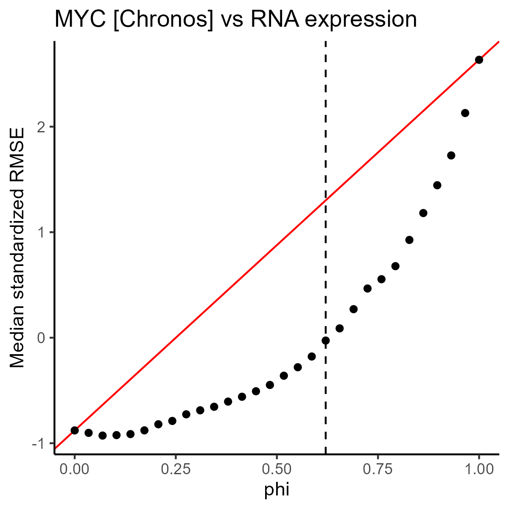
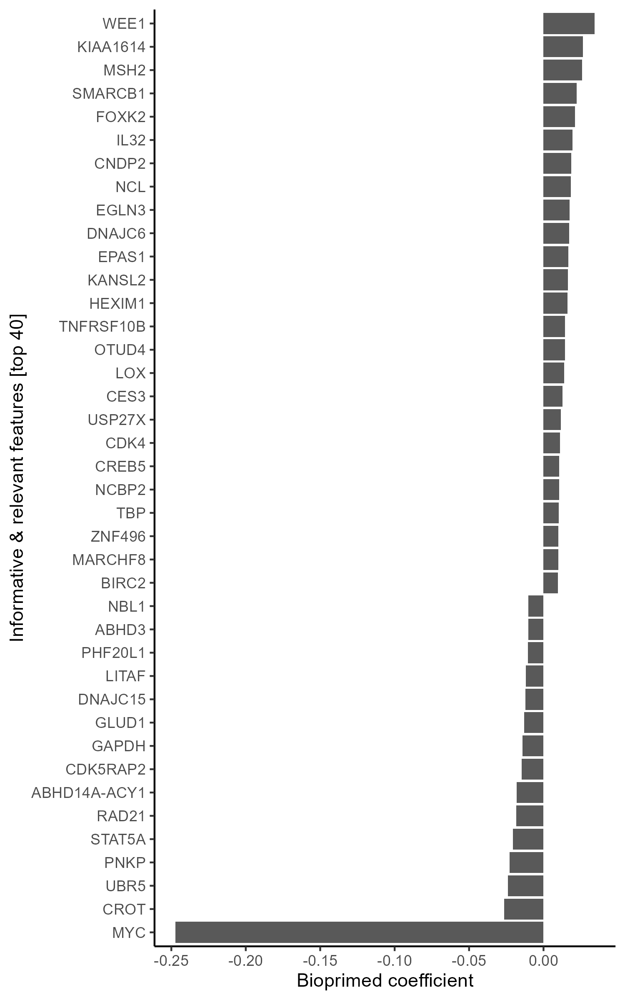
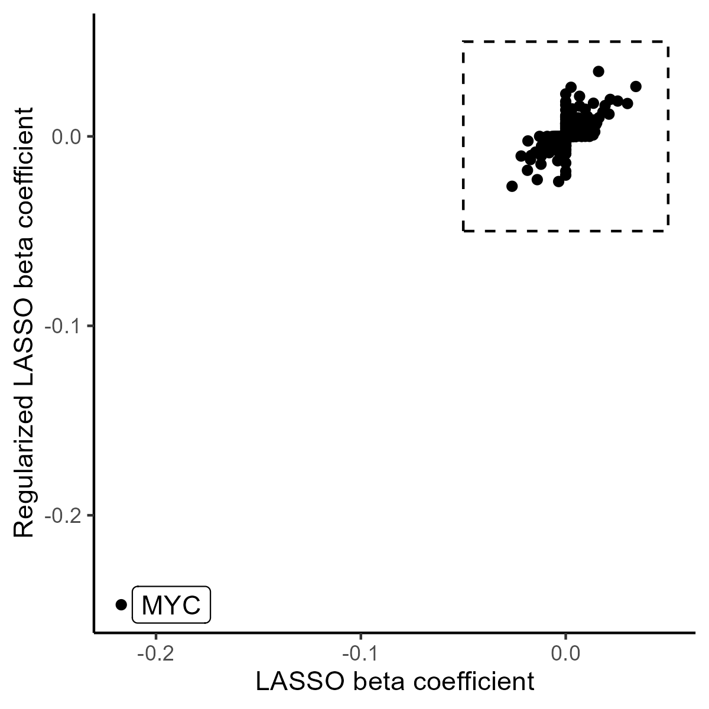
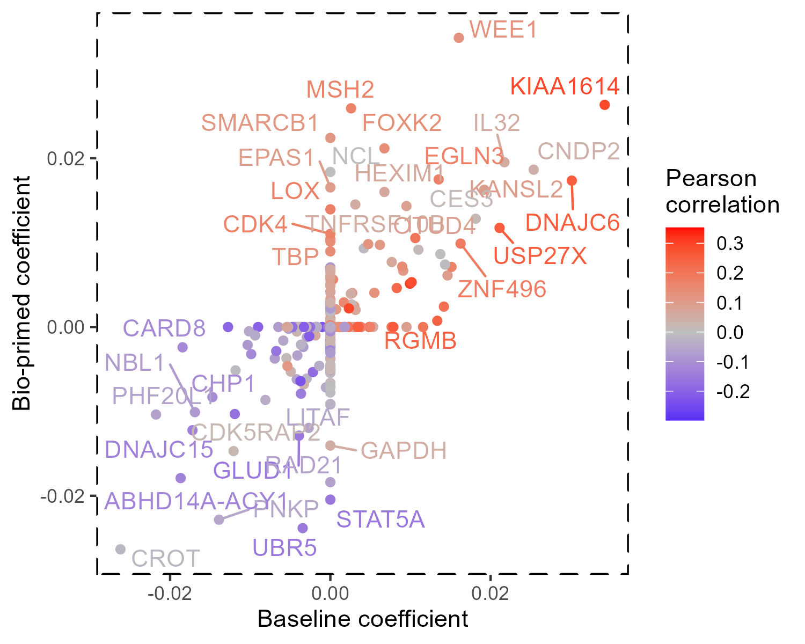
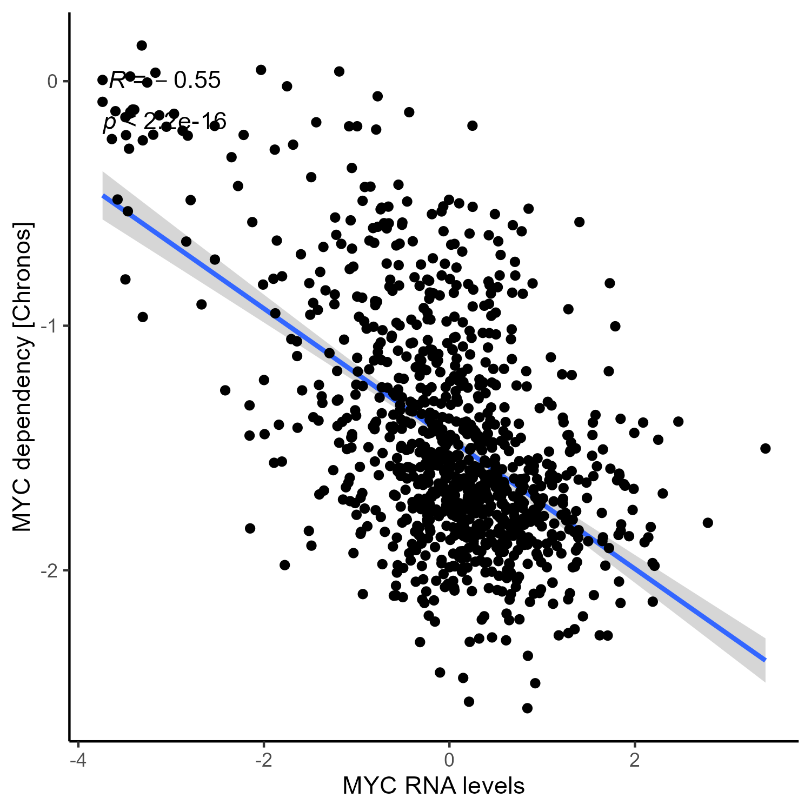
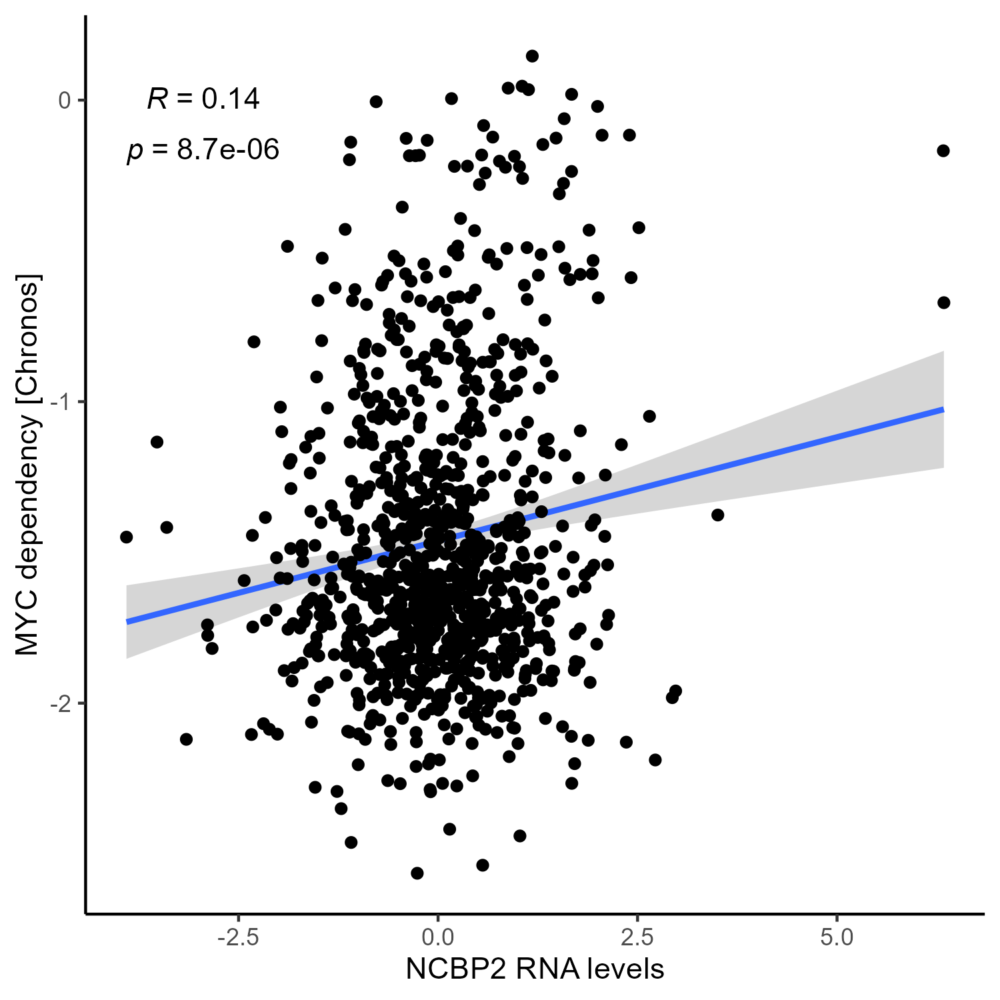
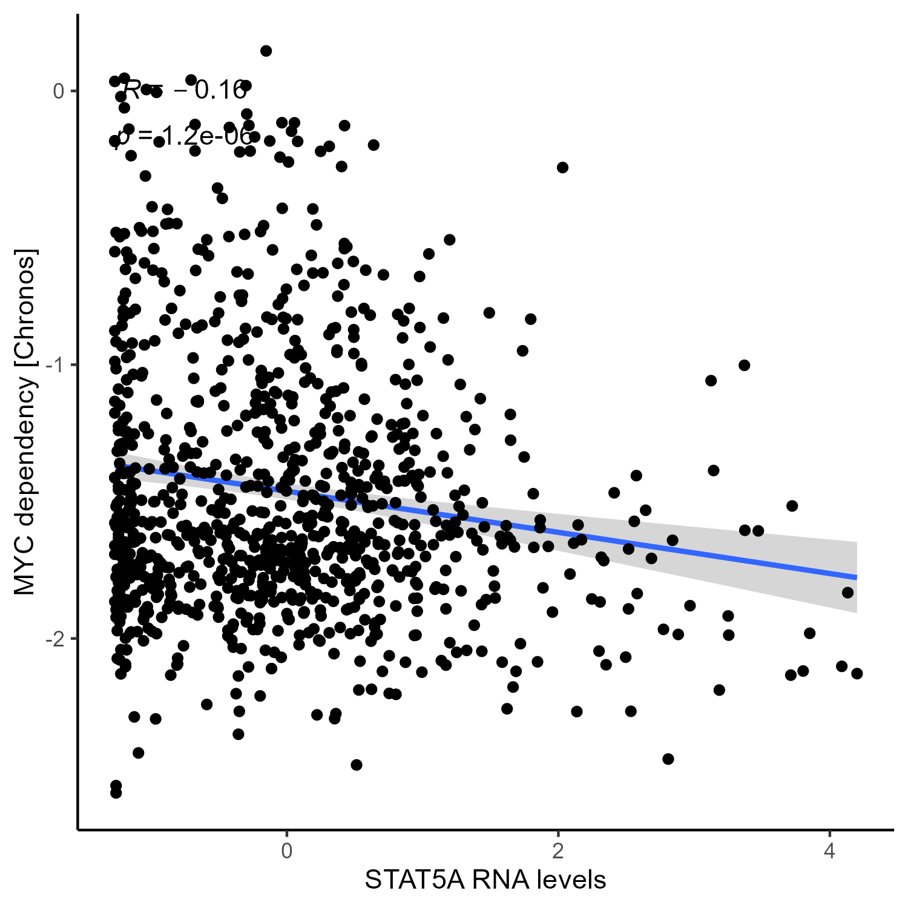

# Figure 2 walk-through

## Predict *MYC* dependency using RNA expression biomarkers

#### 1) Library loads

``` r
library("BioPrimeLASSO")
library("biomaRt")
library("ggplot2")
library("ggpubr")
library("ggrepel")
```

#### 2) Load data (total size \~1Gb)

In this example we will use BioPrimeLASSO to discover RNASeq biomarkers for *MYC* dependency. BioPrimeLASSO also makes use of Protein-Protein interaction information from STRING DB. Please download the following three files (total size \~1.5Gb):

1.  Protein-protein interaction network ([ppi_w_symbols.tsv](https://drive.google.com/file/d/1-Flap0yM1Ba4d8ibVYs6ha82snsmAu-v/view?usp=drive_link))
2.  RNA expression ([rna.tsv](https://drive.google.com/file/d/1oNrQNUHXkjVy0HgNnNst9yR_cqKFLYyZ/view?usp=drive_link))
3.  Chronos dependency data ([chronos.tsv](https://drive.google.com/file/d/1_TvvBO26EFDXR7nIXUmEYt919FaD2Ve1/view?usp=drive_link))

``` r
rna <- read.csv("./rna.tsv",sep = '\t',header=T)
ppi <- read.csv("./ppi_w_symbols.tsv",sep = '\t',header=T)
chronos <- read.csv("./chronos.tsv",sep = '\t',header=T)
```

#### 2.1) Load supplemental information

Next, we load some information for each gene including genomic location using the

``` r
mart <- biomaRt::useDataset("hsapiens_gene_ensembl", useMart("ensembl"))
gene_info <- biomaRt::getBM(
  attributes = c("chromosome_name", "start_position", "hgnc_symbol"),
  filters = "hgnc_symbol",
  values = colnames(cnv),
  mart = mart)

chrs <- as.character(1:22)
gene_info <- gene_info[gene_info$chromosome_name %in% chrs, ]
uniq <- names(which(table(gene_info$hgnc_symbol) == 1))
gene_info <- gene_info[gene_info$hgnc_symbol %in% uniq, ]
gene_info$chromosome_name <- factor(
  gene_info$chromosome_name, levels = chrs)
```

#### 3) Define gene of interest: *MYC*

``` r
GoI <- "MYC"
```

#### 4) Setup data objects for analysis

``` r
# Dependency score resource: Chronos
y <- chronos[,GoI]
names(y) <- rownames(chronos)
y <- na.omit(y)

# Identify 'omic information to test against dependency score: cnv
expressed <- apply(rna, 2, function(x) mean(x > 0))
X_omic <- rna[, expressed > 0.95]


## Refine population to overlapping cell lines
ok_cells <- intersect(names(y), rownames(X_omic))
X_omic_OK  <- X_omic[ok_cells, ]
y_ok <- y[ok_cells]

## Remove features without variance ####
X_omic_OK <- X_omic_OK[, apply(X_omic_OK, 2, var) > 0]

### Generate scores
# Format: colnames(network) <- c("combined_score","gene1","gene2")
scores <- get_scores(gene=GoI, network=ppi)
```

#### 5) Run BioPrimeLASSO:pblasso

``` r
results_omic <- bplasso(
  scale(X_omic_OK), y_ok, scores,
  n_folds = 10, phi_range = seq(0, 1, length = 30))

# Add Pearson correlation: cor2score
results_omic$cor2score <- cor(
  X_omic_OK, y_ok,
  use = "pairwise.complete")[,1]

# Save results
file_results <- paste0("./",GoI,"_chronos_RNA.RData")
save(results_omic,file = file_results)
```

#### 6) Figure S1. Scatter plot shows the median standardized root mean squared error (y-axis) across a range of Φ values (x-axis). Vertical dashed line represents the inflection point, identified as the optimal Φ.

Steps showing the derivation of Φ's inference

1)  Calculate RMSE over Φ test range at 10x cross validation

2)  Fit a linear trend line of median RMSE

3)  Select Φ with greatest deviation from trend line to median RMSE

``` r
# calulate biological input data
penalties <- scores[match(colnames(scale(X_omic_OK)), names(scores))]
names(penalties) <- colnames(scale(X_omic_OK))
penalties[is.na(penalties)] <- 0
penalties <- penalties/max(scores)

# Choose best lambda
lambda_min <- find_lambda(scale(X_omic_OK), y_ok, plot = F)

# Generate RMSE from cross validation
phi_rmse <- get_rmse_from_xvalid(
  scale(X_omic_OK), y_ok, penalties, phi_range = phi_range, lambda_min =
  lambda_min, n_folds = 10)

# Calculate median RMSE
phi_range <- seq(0, 1, length = 30)
median_rmse <- apply(phi_rmse, 1, median)

fig_s1 <- data.frame(
  phi = phi_range, 
  rmse = median_rmse)

# Fit trend line
trendline<-coef(lm(rmse ~ phi, data = fig_s1[c(1, nrow(fig_s1)), ]))

# Visualize 
ggplot(fig_s1, aes(phi, rmse)) +
  labs(
    title = "MYC [Chronos] vs RNA expression",
    y = "Median standardized RMSE",
    x = "phi"
  ) +
  geom_abline(intercept=trendline[1],slope=trendline[2],color='red') +
  geom_point() +
  geom_vline(xintercept = results_omic[[1]],linetype='dashed') +
  theme_classic()
# ggsave(filename = paste0("./Walkthroughs/FigS1_MYC_phiselect.png"),height=4,width=4)
```

<p align="middle">



</p>

#### 7) Figure 2

Figure 2A) Barplot shows the bio-primed model’s coefficients for all non-zero RNA biomarkers.

``` r
fig_2 <- data.frame(
  gene = rownames(results_omic$betas),
  results_omic$betas,
  cor = cor( scale(X_omic_OK), y_ok)[,1])

fig_2$gene <- factor(
  fig_2$gene, 
  levels = fig_2$gene[order(fig_2$betas_pen)])
ggplot(fig_2[order(abs(fig_2$betas_pen),decreasing = T)[1:40], ], aes(betas_pen, gene)) +
  labs(
    y = "Informative & relevant features [top 40]",
    x = "Bioprimed coefficient"
  ) +
  geom_bar(stat = "identity") +
  theme_classic()
# ggsave(filename = paste0("./Walkthroughs/Fig2A_myc_top40beta.png"),height=8,width=5)
```

<p align="middle">



</p>

Figure 2B) Scatter plot shows the baseline (x-axis) and bio-primed (y-axis) models’ coefficients.

``` r
fig_2$label <- fig_2$gene
fig_2$label[fig_2$betas_pen == 0] <- NA

# myc beta results
myc_xmin <- -0.05
myc_xmax <- 0.05
myc_ymin <- -0.05
myc_ymax <- 0.05
ggplot(fig_2, aes(betas, betas_pen,
                   label = gene)) +
  labs(
    y = "Regularized LASSO beta coefficient",
    x = "LASSO beta coefficient"
  ) +
  annotate('rect',xmin=myc_xmin,xmax=myc_xmax,ymin=myc_ymin,ymax=myc_ymax,color='black',alpha=.9,fill='white',linetype="dashed")+
  geom_point() +
  ggrepel::geom_label_repel(data = fig_2[which(fig_2$gene=="MYC"),],
                            aes(label = gene))+
  theme_classic()
# ggsave(filename = paste0("./Walkthroughs/Fig2C_MYC_BetavBeta.png"),height=4,width=4)
```

<p align="middle">



</p>

Figure 2C) Zoomed in view of the scatter plot, excluding *MYC*, displaying the baseline (x-axis) and bio-primed (y-axis) models’ coefficients colored by Pearson correlation coefficient.

``` r
ggplot(fig_2[fig_2$gene != "MYC", ], aes(betas, betas_pen, 
                                           color = cor,
                                           label = label)) +
  labs(
    y = "Bio-primed coefficient",
    x = "Baseline coefficient"
  ) +
  scale_color_gradient2("Pearson\ncorrelation",
    low = "blue", mid = "grey", high = "red",
    breaks = seq(-0.5, 0.5, length = 11)) +
  geom_point() +
  ggrepel::geom_text_repel(max.overlaps = 20) +
  theme_classic()  +
  ggpubr::border(linetype='dashed')
# ggsave(filename = paste0("./Walkthroughs/Fig2C_myc_betaVScorrSub.png"),height=4,width=5)
```

<p align="middle">



</p>

Figure 2D) Scatter plots with associated Pearson correlation coefficients and p-values show RNA expression (x-axis) and *MYC* dependency (y-axis) for *MYC*, *NCBP2*, and *STAT5A*.

``` r
plot_gene <- function(gene, X, y){
  subm <- data.frame(
    gene = X[, gene],
    y
  )  
  ggplot(subm, aes(gene, y)) +
    labs(
      x = paste(gene, "RNA levels"),
      y = "MYC dependency [Chronos]"
    ) +
    geom_smooth(method = "lm",se=T) +
    geom_point() +
    ggpubr::stat_cor(label.sep='\n') +
    theme_classic() 
  }
# MYC
plot_gene("MYC", scale(X_omic_OK), y_ok)
# ggsave(filename = paste0("./Walkthroughs/Fig2D_RNA_MYC.png"),height=5,width=5)
# NCBP2
plot_gene("NCBP2", scale(X_omic_OK), y_ok)
# ggsave(filename = paste0("./Walkthroughs/Fig2D_RNA_STAT5A.png"),height=5,width=5)
# STAT5A
plot_gene("STAT5A", scale(X_omic_OK), y_ok)
# ggsave(filename = paste0("./Walkthroughs/Fig2D_RNA_NCBP2.png"),height=5,width=5)
```

<p align="middle">

  

</p>
