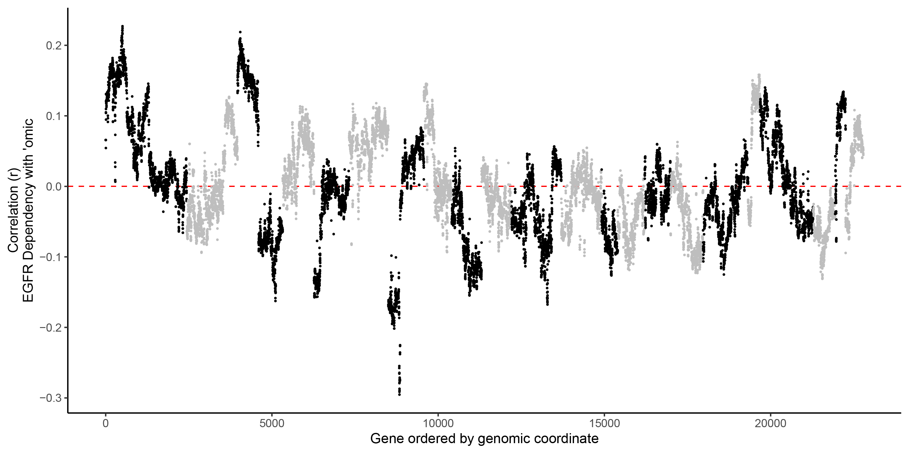
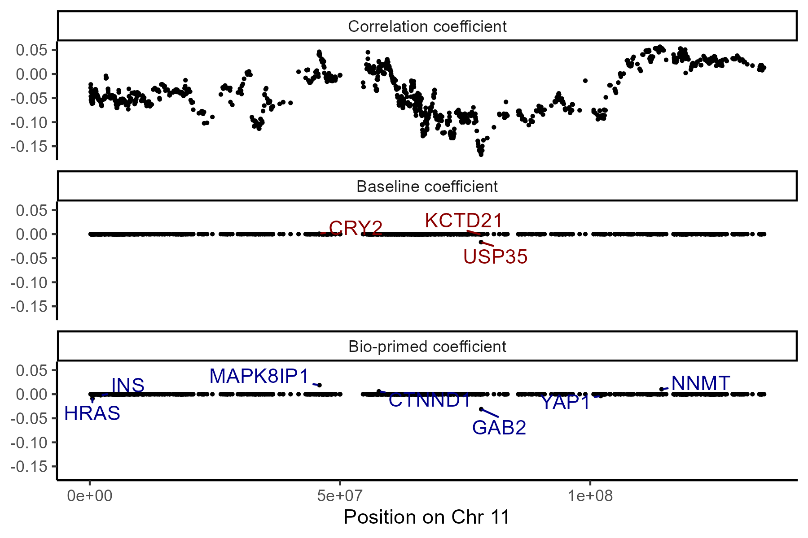
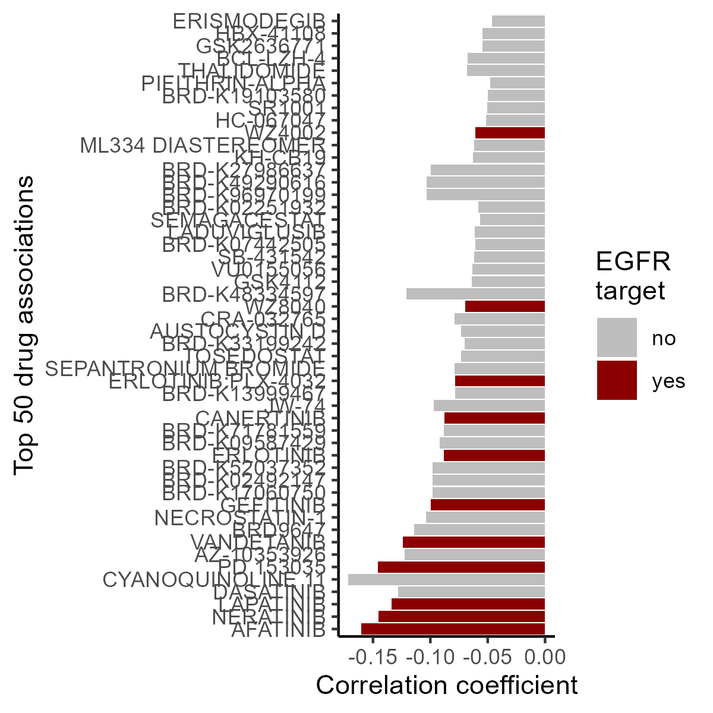
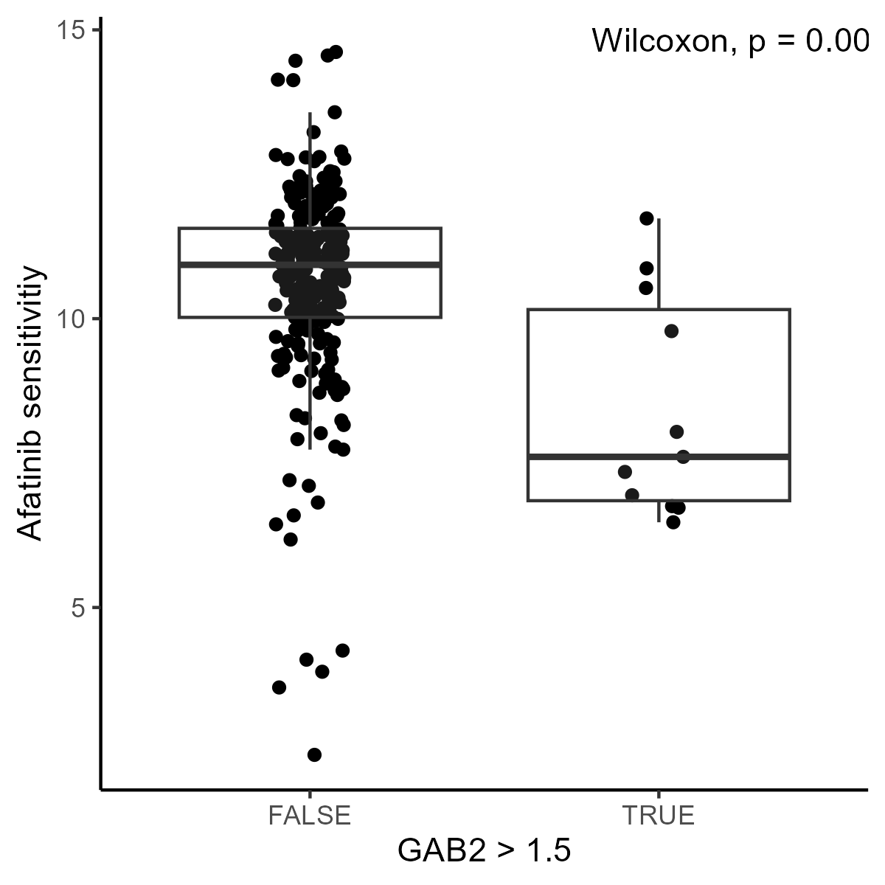

# Figure 3 walk-through

## Predict *EGFR* dependency using copy number biomarkers

#### 1) Library loads

``` r
library("BioPrimeLASSO")
library("biomaRt")
library("ggplot2")
library("ggpubr")
library("ggrepel")
```

#### 2) Load data (total size \~1Gb)

In this example we will use BioPrimeLASSO to discover CNV biomarkers for *EGFR* dependency. BioPrimeLASSO also makes use of Protein-Protein interaction information from STRING DB. Please download the following three files (total size \~1.5Gb):

1.  Protein-protein interaction network ([ppi_w_symbols.tsv](https://drive.google.com/file/d/1-Flap0yM1Ba4d8ibVYs6ha82snsmAu-v/view?usp=drive_link))
2.  Copy number variation ([cnv.tsv](https://drive.google.com/file/d/1dtKIOnx_lVn5glp67ItjPbiSdE10ZFFm/view?usp=drive_link))
3.  Demeter2 dependency data ([demeter2.tsv](https://drive.google.com/file/d/1loo9kdMwAUYoJrBCwe3Dk1b9TDDyY72e/view?usp=drive_link))

``` r
cnv <- read.csv("./cnv.tsv",sep = '\t',header=T)
ppi <- read.csv("./ppi_w_symbols.tsv",sep = '\t',header=T)
demeter2 <- read.csv("./demeter2.tsv",sep = '\t',header=T)
```

#### 2.1) Load supplemental information

Next, we load some information for each gene including genomic location using the

``` r
mart <- useDataset("hsapiens_gene_ensembl", useMart("ensembl"))
gene_info <- getBM(
  attributes = c("chromosome_name", "start_position", "hgnc_symbol"),
  filters = "hgnc_symbol",
  values = colnames(cnv),
  mart = mart)

chrs <- as.character(1:22)
gene_info <- gene_info[gene_info$chromosome_name %in% chrs, ]
uniq <- names(which(table(gene_info$hgnc_symbol) == 1))
gene_info <- gene_info[gene_info$hgnc_symbol %in% uniq, ]
gene_info$chromosome_name <- factor(
  gene_info$chromosome_name, levels = chrs)
```

#### 3) Define gene of interest: *EGFR*

``` r
GoI <- "EGFR"
```

#### 4) Setup data objects for analysis

``` r
# Dependency score resource: Chronos
y <- demeter2[,GoI]
names(y) <- rownames(demeter2)
y <- na.omit(y)

# Identify 'omic information to test against dependency score: cnv
## Remove features without variance ####
X_omic <- cnv[,complete.cases(t(cnv))]
X_omic <- X_omic[, apply(X_omic, 2, var) > 0]

## Refine population to overlapping cell lines
ok_cells <- intersect(names(y), rownames(X_omic))
X_omic_OK  <- X_omic[ok_cells, ]
y_ok <- y[ok_cells]

### Generate scores
# Format: colnames(network) <- c("combined_score","gene1","gene2")
scores <- get_scores(gene=GoI, network=ppi)
```

#### 5) Run BioPrimeLASSO:pblasso

``` r
results_omic <- bplasso(
  scale(X_omic_OK), y_ok, scores,
  n_folds = 10, phi_range = seq(0, 1, length = 30))

# Add Pearson correlation: cor2score
results_omic$cor2score <- cor(
  X_omic_OK, y_ok,
  use = "pairwise.complete")[,1]

# Save results
file_results <- paste0("./",GoI,"_demeter2_cnv.RData")
save(results_omic,file = file_results)
```

#### 6) Figure 3

Figure 3A) Scatter plot shows the correlation coefficient between gene-level CNV variation and *EGFR* dependency (y-axis) across genes sorted by genomic location (x-axis). Points are colored to distinguish adjacent chromosomes.

``` r
plot_manhattan(gene=GoI,
  resIn=file_results,
  subplotChr=NA,
  dependency=demeter2,
  gene_info=gene_info,
  dir_save="./")
```

<p align="middle">



</p>

Figure 3B) Scatter plot shows correlation (top), baseline (middle) and bio-primed (bottom) models’ coefficients restricted to chromosome 14. *GAB2* is assigned non-zero coefficient in the bio-primed but not in the baseline model.

``` r
betas <- results_omic$betas
ok_cell <- intersect(rownames(demeter2),rownames(scale(X_omic_OK)))
cor_D2cnv <-  cor(
  scale(X_omic_OK)[ok_cell, ], demeter2[ok_cell,'EGFR'],
  use = "pairwise.complete")[,1]
betas$cor <- cor_D2cnv[match(rownames(betas),names(cor_D2cnv))]
betas$gene <- rownames(betas)
betas <-cbind(betas,gene_info[match(betas$gene,gene_info$hgnc_symbol),])

chrqry <- betas$chromosome_name[which(betas$hgnc_symbol=="GAB2")] #Chr11
betas11 <-betas[which(betas$chromosome_name==chrqry),]
betas11m <- reshape2::melt(betas11,measure.vars=c("betas","betas_pen","cor"))
betas11m$variable <- factor(betas11m$variable,levels=c("cor","betas","betas_pen"),labels = c("Correlation coefficient","Baseline coefficient","Bio-primed coefficient"))

ggplot(betas11m,aes(x=start_position, y=value))+
  geom_point(size=.5)+theme_classic()+
  labs(x=paste0('Position on Chr ',chrqry),y=NULL)+
  facet_wrap(~variable,ncol=1)+
  ggrepel::geom_text_repel(
    min.segment.length = 0,
    force=1,direction='both',max.overlaps=100,
    max.time = .3, max.iter = 1e5,
    data =betas11m[betas11m$variable%in%c("Baseline coefficient","Bio-primed coefficient")&betas11m$value!=0,],
    aes(label = gene, color = variable))+
  scale_color_manual(guide = "none",labels=c("Baseline coefficient","Bio-primed coefficient"),values=c("darkred","darkblue"))
# ggsave(filename = paste0("./Walkthroughs/Fig3B_boxplot_EGFR_cnv.png"),width = 6,height = 4)
```

<p align="middle">



</p>

Figure 3C) Boxplots show *EGFR* dependency (y-axis) across cell lines stratified by combinations of CN gains of *EGFR* and *GAB2*.

``` r
plot_Xcompare <- function(gene,gene2="GAB2",score_nam="demeter2",X_=cnv,omic=c("CNV","RNA")[1]){
  if(score_nam=="demeter2"){ score <- demeter2;s2 <- '[D2]' }else {score=chronos;s2 <- '[Ch]'}
  y <- score[,gene]
  x <- X_[match(names(y),rownames(X_)),]
  omic_cutoff<- 1.2
  df <- data.frame(d2=y,log1=x[,gene],log2=x[,gene2])
  df$d2 <-as.numeric(df$d2)
  df <-df[complete.cases(df),]
  breaks <- c('Normal', paste0(gene," only\ngain"), paste0(gene2," only\ngain"), paste0(gene," & ",gene2,"\ngain"))
  breaksVal <- c("FALSE.FALSE","TRUE.FALSE","FALSE.TRUE","TRUE.TRUE")
  names(breaksVal) <- breaks
  breaksVal<-breaksVal[breaksVal%in% unique(interaction(df$log1>=omic_cutoff,df$log2>=omic_cutoff))]
  gbox <-  ggplot(df,aes(y=d2,x=interaction(log1>=omic_cutoff,log2>=omic_cutoff)))+
  geom_jitter(width = .1,size=.5)+
  geom_boxplot(alpha=0.5,outlier.shape = NA)+
  ggpubr::stat_compare_means(comparisons =list(c(1,2),c(1,3),c(2,4)))+
  labs(y=paste0(gene," dependency ",s2),x=omic)+
  scale_x_discrete(labels= names(breaksVal))+
  theme_classic()
  plot(gbox)
}

plot_Xcompare(gene="EGFR",gene2="GAB2",score_nam="demeter2",X_=cnv,omic="CNV")
# ggsave(filename = paste0("./Walkthroughs/Fig3C_EGFR_GAB2gain.png"),width = 4,height = 4)
```

<p align="middle">


</p>

Figure 3D) Barplot shows correlation coefficient between drug sensitivity and *GAB2* CN variation (x-axis) for the top 50 negative associations (y-axis). Colors indicate if the drug targets *EGFR*.

``` r
# Load data ####
drug_info <- read.csv("./depmap_drug_metadata.csv",row.names = 1)
drug <- read.csv("./depmap_drug_auc.csv",row.names = 1)

# Associate drug sensitivity with CNV ###
sampIntersect <- intersect(rownames(cnv), rownames(drug))
gab2 <- cnv[sampIntersect, "GAB2"]
df_f2d <- apply(drug[sampIntersect,], 2, function(x) try(cor.test(x, gab2)))
names(df_f2d) <- colnames(drug)
df_f2d <- do.call(rbind, lapply(df_f2d, function(x)
  as.numeric(x[c("estimate", "p.value")])))
colnames(df_f2d) <- c("coef", "pval")
df_f2d <- data.frame(drug_info, df_f2d)


df_f2d <- df_f2d[df_f2d$data_set == "CTD^2" & df_f2d < 0, ]
df_f2d <- df_f2d[df_f2d$coef < 0, ]
df_f2d <- df_f2d[sort.list(df_f2d$pval), ]

df_f2d$drug_name <- factor(df_f2d$drug_name, levels = df_f2d$drug_name[order(df_f2d$pval)])

df_f2d$egfr <- "no"
df_f2d$egfr[grep("EGFR", df_f2d$target)] <- "yes"

ggplot(df_f2d[1:50, ], aes(coef, drug_name, fill = egfr)) +
  labs(
    x = "Correlation coefficient",
    y = "Top 50 drug associations",
    fill = "EGFR\ntarget"
  ) +
  scale_fill_manual(
    values = c("grey", "darkred")
  ) +
  geom_bar(stat = 'identity') +
  theme_classic()
# ggsave(filename = paste0("./Walkthroughs/Fig3D_EGFR_drugCorr.png"),width = 4,height = 4)
```

<p align="middle">



</p>

Figure 3E) Boxplots shows Afatinib sensitivity (y-axis) across *GAB2* amplification status (x-axis) restricted to cell lines with CN neutral *EGFR*.

``` r
df_f2e <- data.frame(
  cnv[sampIntersect, c("EGFR", "GAB2")], 
  drug = drug[sampIntersect, "Drug.sensitivity.AUC..CTD.2..AFATINIB..CTRP.606135."])

ggplot(df_f2e[df_f2e$EGFR > 0.9 & df_f2e$EGFR < 1.1, ], 
       aes(GAB2 > 1.5, drug)) +
  labs(y = "Afatinib sensitivitiy") +
  geom_jitter(width = 0.1) + 
  geom_boxplot(outlier.colour = NA, alpha = 0.1) + 
  ggpubr::stat_compare_means(label.x.npc = "right") + 
  theme_classic()
# ggsave(filename = paste0("./Walkthroughs/Fig3E_GAB2_AfatinibSens.png"),width = 4,height = 4)
```

<p align="middle">



</p>
